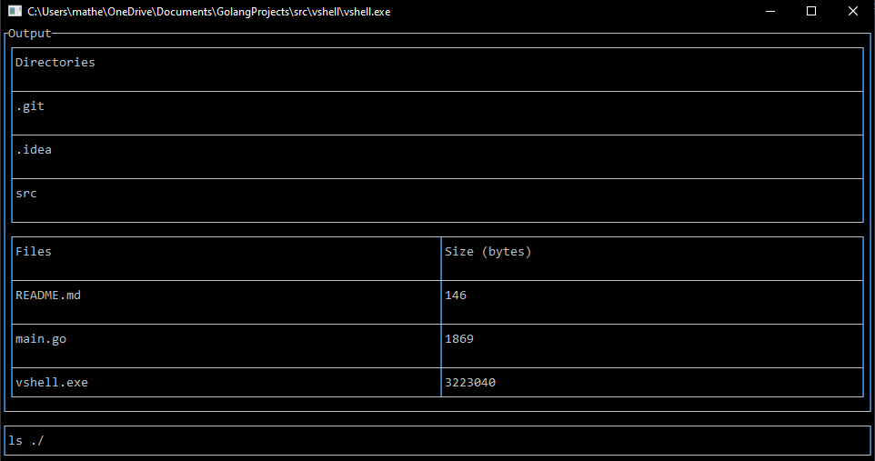

# VSHELL, or visual-shell

### an intuitive command-line

## Custom commands
| Primary | First Argument | Description                    |
|---------|----------------|--------------------------------|
| cd      | path           | change directory               |
| ls      | path           | list all files and directories |
| mkdir   | name           | creates a new directory        |

## Philosophy
We want people to be able to use this terminal without even having to touch anything else.

## Frameworks used
* `tui-go` _(for the UI)_